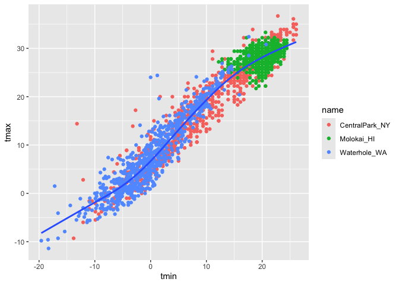

Visualization
================

``` r
library(tidyverse)
```

    ## ── Attaching core tidyverse packages ──────────────────────── tidyverse 2.0.0 ──
    ## ✔ dplyr     1.1.4     ✔ readr     2.1.5
    ## ✔ forcats   1.0.0     ✔ stringr   1.5.1
    ## ✔ ggplot2   3.5.1     ✔ tibble    3.2.1
    ## ✔ lubridate 1.9.3     ✔ tidyr     1.3.1
    ## ✔ purrr     1.0.2     
    ## ── Conflicts ────────────────────────────────────────── tidyverse_conflicts() ──
    ## ✖ dplyr::filter() masks stats::filter()
    ## ✖ dplyr::lag()    masks stats::lag()
    ## ℹ Use the conflicted package (<http://conflicted.r-lib.org/>) to force all conflicts to become errors

``` r
library(ggridges)
```

## Load the weather data

So rnoaa is a publicly available source of data. The three titles in the
first row c(“shhg”)are different weather stations on the public site and
I’m getting info from them. We are looking at particular variables,
precipitation and min and max temp. So it’s getting this info from the
publicly available site. The names are the locations of those weather
stations. The Tmin was also divided by 10 because of how it was entered
into the set.

``` r
weather_df = 
  rnoaa::meteo_pull_monitors(
    c("USW00094728", "USW00022534", "USS0023B17S"),
    var = c("PRCP", "TMIN", "TMAX"), 
    date_min = "2021-01-01",
    date_max = "2022-12-31") |>
  mutate(
    name = case_match(
      id, 
      "USW00094728" ~ "CentralPark_NY", 
      "USW00022534" ~ "Molokai_HI",
      "USS0023B17S" ~ "Waterhole_WA"),
    tmin = tmin / 10,
    tmax = tmax / 10) |>
  select(name, id, everything())
```

    ## using cached file: /Users/chimsom.agbim/Library/Caches/org.R-project.R/R/rnoaa/noaa_ghcnd/USW00094728.dly

    ## date created (size, mb): 2024-10-21 14:37:45.431514 (8.657)

    ## file min/max dates: 1869-01-01 / 2024-10-31

    ## using cached file: /Users/chimsom.agbim/Library/Caches/org.R-project.R/R/rnoaa/noaa_ghcnd/USW00022534.dly

    ## date created (size, mb): 2024-10-21 14:37:51.132323 (3.938)

    ## file min/max dates: 1949-10-01 / 2024-10-31

    ## using cached file: /Users/chimsom.agbim/Library/Caches/org.R-project.R/R/rnoaa/noaa_ghcnd/USS0023B17S.dly

    ## date created (size, mb): 2024-10-21 14:37:53.122688 (1.039)

    ## file min/max dates: 1999-09-01 / 2024-10-31

## Scatterplots!

Create my first scatterplot. You first enter the data set, then x and y.
You add the geom point to get the scatterplot.

``` r
ggplot(weather_df, aes( x= tmin, y = tmax)) + 
  geom_point()
```

    ## Warning: Removed 17 rows containing missing values or values outside the scale range
    ## (`geom_point()`).

<!-- --> New approach,
same plot

``` r
weather_df %>% 
  ggplot(aes(x= tmin, y = tmax)) + geom_point()
```

    ## Warning: Removed 17 rows containing missing values or values outside the scale range
    ## (`geom_point()`).

<!-- --> Save and edit
a plot object: so just the plot without the data points

``` r
weather_plot =
  weather_df %>% 
  ggplot(aes(x= tmin, y=tmax))
weather_plot
```

<!-- --> Now I can go
back and add geom_point to that plot

``` r
weather_plot + geom_point()
```

    ## Warning: Removed 17 rows containing missing values or values outside the scale range
    ## (`geom_point()`).

<!-- --> \## Advanced
scatterplots… Start with the same one and make it fancy! Now I’m telling
it to assign a color based on names.

``` r
ggplot(weather_df, aes( x= tmin, y = tmax, color = name)) + 
  geom_point()
```

    ## Warning: Removed 17 rows containing missing values or values outside the scale range
    ## (`geom_point()`).

<!-- --> Now I’ll add a
lines that run through the middle of the data set for each color.He
plotted with standard error being false, not quite sure what that means
but you can still plot without that argument.

``` r
ggplot(weather_df, aes( x= tmin, y = tmax, color = name)) + 
  geom_point() + geom_smooth(se= FALSE)
```

    ## `geom_smooth()` using method = 'loess' and formula = 'y ~ x'

    ## Warning: Removed 17 rows containing non-finite outside the scale range
    ## (`stat_smooth()`).

    ## Warning: Removed 17 rows containing missing values or values outside the scale range
    ## (`geom_point()`).

<!-- --> What happens
if I change the color aesthetic placement? Here it creates a single line
for all of the data because instead of assigning color to particular
region, it puts it for the plot in general when it’s in geom_point.

``` r
ggplot(weather_df, aes(x= tmin, y = tmax)) + 
  geom_point(aes(color = name)) + geom_smooth(se= FALSE)
```

    ## `geom_smooth()` using method = 'gam' and formula = 'y ~ s(x, bs = "cs")'

    ## Warning: Removed 17 rows containing non-finite outside the scale range
    ## (`stat_smooth()`).

    ## Warning: Removed 17 rows containing missing values or values outside the scale range
    ## (`geom_point()`).

<!-- --> Let’s facet
some things!

Going back to the original plot with separate smooth lines. Facet
creates separate scatterplots for each name (. = don’t create rows, the
label after the ~ specifies that I want to separate into columns)

``` r
ggplot(weather_df, aes( x= tmin, y = tmax, color = name)) + 
  geom_point() + geom_smooth(se= FALSE) +
  facet_grid(. ~ name)
```

    ## `geom_smooth()` using method = 'loess' and formula = 'y ~ x'

    ## Warning: Removed 17 rows containing non-finite outside the scale range
    ## (`stat_smooth()`).

    ## Warning: Removed 17 rows containing missing values or values outside the scale range
    ## (`geom_point()`).

<!-- --> If I change
the order of the variables in the facet function, the display of the
scatterplots will also vary.

This time, I’m telling it to make 3 rows for my names, instead of
columns for the names (name in the file corresponds to region).

``` r
ggplot(weather_df, aes( x= tmin, y = tmax, color = name)) + 
  geom_point() + geom_smooth(se= FALSE) +
  facet_grid(name ~.)
```

    ## `geom_smooth()` using method = 'loess' and formula = 'y ~ x'

    ## Warning: Removed 17 rows containing non-finite outside the scale range
    ## (`stat_smooth()`).

    ## Warning: Removed 17 rows containing missing values or values outside the scale range
    ## (`geom_point()`).

<!-- --> I can also
make the individual data points themselves a bit more transparent so
it’s easier to see the line running through the middle of data. I change
the `alpha` in the geom_point function or even adding `size` to the
geom_point to change the size of the points

``` r
ggplot(weather_df, aes( x= tmin, y = tmax, color = name)) + 
  geom_point(alpha =0.5, size = 0.4) + geom_smooth(se= FALSE) +
  facet_grid(. ~ name)
```

    ## `geom_smooth()` using method = 'loess' and formula = 'y ~ x'

    ## Warning: Removed 17 rows containing non-finite outside the scale range
    ## (`stat_smooth()`).

    ## Warning: Removed 17 rows containing missing values or values outside the scale range
    ## (`geom_point()`).

<!-- --> You can also
change the transparency of the points based on the tmin, for example. So
you see the gradient of temperatures

``` r
ggplot(weather_df, aes( x= tmin, y = tmax, alpha =tmin, color = name)) + 
  geom_point( size = 0.4) + geom_smooth(se= FALSE) +
  facet_grid(. ~ name)
```

    ## `geom_smooth()` using method = 'loess' and formula = 'y ~ x'

    ## Warning: Removed 17 rows containing non-finite outside the scale range
    ## (`stat_smooth()`).

    ## Warning: The following aesthetics were dropped during statistical transformation: alpha.
    ## ℹ This can happen when ggplot fails to infer the correct grouping structure in
    ##   the data.
    ## ℹ Did you forget to specify a `group` aesthetic or to convert a numerical
    ##   variable into a factor?
    ## The following aesthetics were dropped during statistical transformation: alpha.
    ## ℹ This can happen when ggplot fails to infer the correct grouping structure in
    ##   the data.
    ## ℹ Did you forget to specify a `group` aesthetic or to convert a numerical
    ##   variable into a factor?
    ## The following aesthetics were dropped during statistical transformation: alpha.
    ## ℹ This can happen when ggplot fails to infer the correct grouping structure in
    ##   the data.
    ## ℹ Did you forget to specify a `group` aesthetic or to convert a numerical
    ##   variable into a factor?

    ## Warning: Removed 17 rows containing missing values or values outside the scale range
    ## (`geom_point()`).

<!-- --> Let’s combine
some elements and try a new plot. Here, we plot the max temperatures (y)
over dates (x). I also wanted to plot the size of the points based on
the amount of precipitation at that time.And then of course if I wanted
to create 3 separate plots based on the cities, I could use the facet
function above.

``` r
weather_df %>% 
  ggplot(aes(x=date, y= tmax, color= name)) + geom_point( aes(size = prcp), alpha =0.5) +
geom_smooth(se = FALSE)
```

    ## `geom_smooth()` using method = 'loess' and formula = 'y ~ x'

    ## Warning: Removed 17 rows containing non-finite outside the scale range
    ## (`stat_smooth()`).

    ## Warning: Removed 19 rows containing missing values or values outside the scale range
    ## (`geom_point()`).

<!-- --> \## Some
small notes

There’s also a hexagonal option for the shape of your points. You may
need to install geom_hex if it asks, click 1 for yes.

``` r
weather_df %>% 
  ggplot(aes(x=date, y= tmax, color= name)) + geom_hex()
```

    ## Warning: Removed 17 rows containing non-finite outside the scale range
    ## (`stat_binhex()`).

<!-- --> \##
Univariate Plots

Histograms

You can add color for each bar using this function

``` r
weather_df %>% 
  ggplot(aes(x=tmin, fill =name)) + geom_histogram()
```

    ## `stat_bin()` using `bins = 30`. Pick better value with `binwidth`.

    ## Warning: Removed 17 rows containing non-finite outside the scale range
    ## (`stat_bin()`).

<!-- --> However, they
are overlapping, so I will tell the values to dodge each other

``` r
weather_df %>% 
  ggplot(aes(x=tmin, fill =name)) + geom_histogram(position = "dodge")
```

    ## `stat_bin()` using `bins = 30`. Pick better value with `binwidth`.

    ## Warning: Removed 17 rows containing non-finite outside the scale range
    ## (`stat_bin()`).

<!-- --> I could
alternatively tell it to create separate plots

``` r
weather_df %>% 
  ggplot(aes(x=tmin, fill =name)) + geom_histogram() + facet_grid(. ~ name)
```

    ## `stat_bin()` using `bins = 30`. Pick better value with `binwidth`.

    ## Warning: Removed 17 rows containing non-finite outside the scale range
    ## (`stat_bin()`).

<!-- --> You can also
make smoothed out histograms

``` r
weather_df %>% 
  ggplot(aes(x=tmin, fill =name)) + geom_density() 
```

    ## Warning: Removed 17 rows containing non-finite outside the scale range
    ## (`stat_density()`).

<!-- --> Making Box
plots

``` r
weather_df %>% 
  ggplot(aes(x=name, y=tmin)) + geom_boxplot() 
```

    ## Warning: Removed 17 rows containing non-finite outside the scale range
    ## (`stat_boxplot()`).

<!-- --> Violin Plots

You can add stat_summary to get the mean (by default if you don’t set an
argument). I have it set to find the median

``` r
weather_df %>% 
  ggplot(aes(x=name, y=tmin, fill = name)) + geom_violin() + stat_summary( fun ="median")
```

    ## Warning: Removed 17 rows containing non-finite outside the scale range
    ## (`stat_ydensity()`).

    ## Warning: Removed 17 rows containing non-finite outside the scale range
    ## (`stat_summary()`).

    ## Warning: Removed 3 rows containing missing values or values outside the scale range
    ## (`geom_segment()`).

<!-- --> Ridge plot

``` r
weather_df %>% 
  ggplot(aes(x=tmin, y=name)) + geom_density_ridges()
```

    ## Picking joint bandwidth of 1.41

    ## Warning: Removed 17 rows containing non-finite outside the scale range
    ## (`stat_density_ridges()`).

<!-- -->
