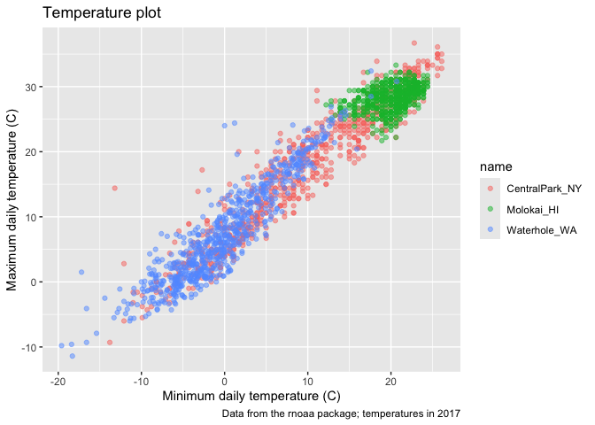
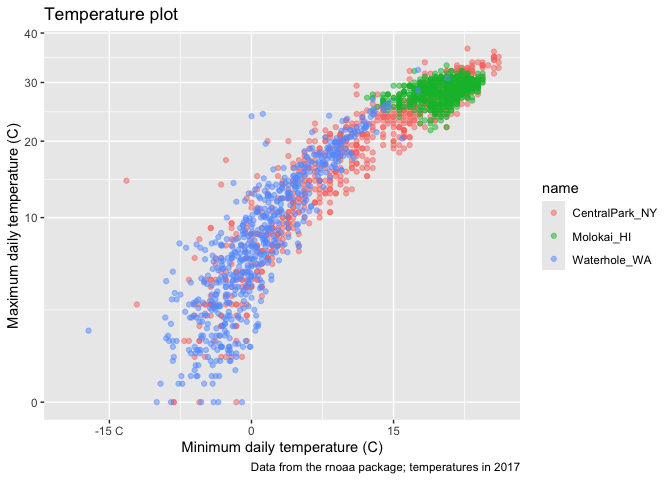
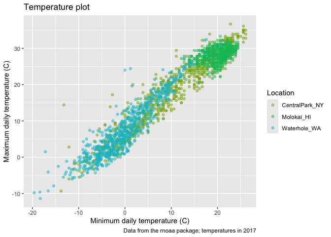
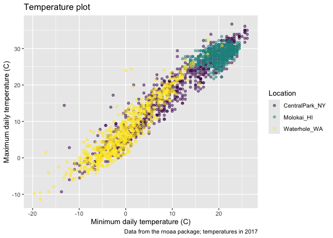

Visualization
================

We load patchwork to make different types of plots

``` r
library(tidyverse)
```

    ## ── Attaching core tidyverse packages ──────────────────────── tidyverse 2.0.0 ──
    ## ✔ dplyr     1.1.4     ✔ readr     2.1.5
    ## ✔ forcats   1.0.0     ✔ stringr   1.5.1
    ## ✔ ggplot2   3.5.1     ✔ tibble    3.2.1
    ## ✔ lubridate 1.9.3     ✔ tidyr     1.3.1
    ## ✔ purrr     1.0.2     
    ## ── Conflicts ────────────────────────────────────────── tidyverse_conflicts() ──
    ## ✖ dplyr::filter() masks stats::filter()
    ## ✖ dplyr::lag()    masks stats::lag()
    ## ℹ Use the conflicted package (<http://conflicted.r-lib.org/>) to force all conflicts to become errors

``` r
library(patchwork)
```

## Load the weather data

So rnoaa is a publicly available source of data. The three titles in the
first row c(“shhg”)are different weather stations on the public site and
I’m getting info from them. We are looking at particular variables,
precipitation and min and max temp. So it’s getting this info from the
publicly available site. The names are the locations of those weather
stations. The Tmin was also divided by 10 because of how it was entered
into the set.

``` r
weather_df = 
  rnoaa::meteo_pull_monitors(
    c("USW00094728", "USW00022534", "USS0023B17S"),
    var = c("PRCP", "TMIN", "TMAX"), 
    date_min = "2021-01-01",
    date_max = "2022-12-31") |>
  mutate(
    name = case_match(
      id, 
      "USW00094728" ~ "CentralPark_NY", 
      "USW00022534" ~ "Molokai_HI",
      "USS0023B17S" ~ "Waterhole_WA"),
    tmin = tmin / 10,
    tmax = tmax / 10) |>
  select(name, id, everything())
```

    ## using cached file: /Users/chimsom.agbim/Library/Caches/org.R-project.R/R/rnoaa/noaa_ghcnd/USW00094728.dly

    ## date created (size, mb): 2024-10-21 14:37:45.431514 (8.657)

    ## file min/max dates: 1869-01-01 / 2024-10-31

    ## using cached file: /Users/chimsom.agbim/Library/Caches/org.R-project.R/R/rnoaa/noaa_ghcnd/USW00022534.dly

    ## date created (size, mb): 2024-10-21 14:37:51.132323 (3.938)

    ## file min/max dates: 1949-10-01 / 2024-10-31

    ## using cached file: /Users/chimsom.agbim/Library/Caches/org.R-project.R/R/rnoaa/noaa_ghcnd/USS0023B17S.dly

    ## date created (size, mb): 2024-10-21 14:37:53.122688 (1.039)

    ## file min/max dates: 1999-09-01 / 2024-10-31

``` r
weather_df
```

    ## # A tibble: 2,190 × 6
    ##    name           id          date        prcp  tmax  tmin
    ##    <chr>          <chr>       <date>     <dbl> <dbl> <dbl>
    ##  1 CentralPark_NY USW00094728 2021-01-01   157   4.4   0.6
    ##  2 CentralPark_NY USW00094728 2021-01-02    13  10.6   2.2
    ##  3 CentralPark_NY USW00094728 2021-01-03    56   3.3   1.1
    ##  4 CentralPark_NY USW00094728 2021-01-04     5   6.1   1.7
    ##  5 CentralPark_NY USW00094728 2021-01-05     0   5.6   2.2
    ##  6 CentralPark_NY USW00094728 2021-01-06     0   5     1.1
    ##  7 CentralPark_NY USW00094728 2021-01-07     0   5    -1  
    ##  8 CentralPark_NY USW00094728 2021-01-08     0   2.8  -2.7
    ##  9 CentralPark_NY USW00094728 2021-01-09     0   2.8  -4.3
    ## 10 CentralPark_NY USW00094728 2021-01-10     0   5    -1.6
    ## # ℹ 2,180 more rows

## Remember this plot?

``` r
weather_df %>% 
  ggplot(aes(x = tmin, y=tmax, color = name)) +
  geom_point(alpha=0.5)
```

    ## Warning: Removed 17 rows containing missing values or values outside the scale range
    ## (`geom_point()`).

<!-- -->

## Labels

We can add labels to this plot

``` r
weather_df %>% 
  ggplot(aes(x = tmin, y=tmax, color = name)) +
  geom_point(alpha=0.5) +
labs(
  title = "Temperature plot",
  x = "Minimum daily temperature (C)",
  y = "Maximum daily temperature (C)",
  caption = "Data from the rnoaa package; temperatures in 2017"
)
```

    ## Warning: Removed 17 rows containing missing values or values outside the scale range
    ## (`geom_point()`).

<!-- --> \##Scales
Start with the same plot, but now I can change the scale on each axis. I
can also change the y axis so the values are plotted by the sqrt of the
original.

``` r
weather_df %>% 
  ggplot(aes(x = tmin, y=tmax, color = name)) +
  geom_point(alpha=0.5) +
labs(
  title = "Temperature plot",
  x = "Minimum daily temperature (C)",
  y = "Maximum daily temperature (C)",
  caption = "Data from the rnoaa package; temperatures in 2017"
) +
scale_x_continuous(
  breaks = c(-15, 0, 15),
  labels = c("-15 C", "0", "15")
) +
  scale_y_continuous(
    trans = "sqrt"
  )
```

    ## Warning in transformation$transform(x): NaNs produced

    ## Warning in scale_y_continuous(trans = "sqrt"): sqrt transformation introduced
    ## infinite values.

    ## Warning: Removed 142 rows containing missing values or values outside the scale range
    ## (`geom_point()`).

<!-- --> Adding color
to scales. The numbers you enter into the hue function correspond to
colors. The further the numbers are apart, I believe the further the
difference in the hue. I am also telling the code to change name to
location for the hues.

``` r
weather_df %>% 
  ggplot(aes(x = tmin, y=tmax, color = name)) +
  geom_point(alpha=0.5) +
labs(
  title = "Temperature plot",
  x = "Minimum daily temperature (C)",
  y = "Maximum daily temperature (C)",
  caption = "Data from the rnoaa package; temperatures in 2017"
) +
  scale_color_hue(
    name = "Location",
    h= c(100, 200))
```

    ## Warning: Removed 17 rows containing missing values or values outside the scale range
    ## (`geom_point()`).

<!-- --> You can also
use colors from the viridis color scale- I guess the main benefit is for
color blind patients, but truly I am not a fan of this scale.

``` r
weather_df %>% 
  ggplot(aes(x = tmin, y=tmax, color = name)) +
  geom_point(alpha=0.5) +
labs(
  title = "Temperature plot",
  x = "Minimum daily temperature (C)",
  y = "Maximum daily temperature (C)",
  caption = "Data from the rnoaa package; temperatures in 2017"
) +
  viridis::scale_color_viridis(
    name = "Location",
    discrete = TRUE
  )
```

    ## Warning: Removed 17 rows containing missing values or values outside the scale range
    ## (`geom_point()`).

<!-- -->
