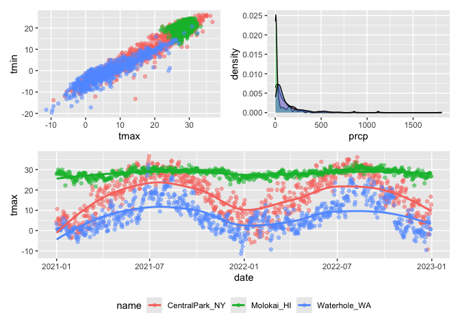
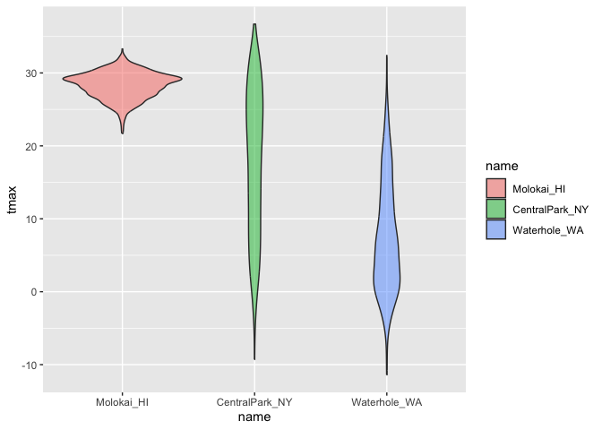

Visualization
================

We load patchwork to make different types of plots

``` r
library(tidyverse)
```

    ## ── Attaching core tidyverse packages ──────────────────────── tidyverse 2.0.0 ──
    ## ✔ dplyr     1.1.4     ✔ readr     2.1.5
    ## ✔ forcats   1.0.0     ✔ stringr   1.5.1
    ## ✔ ggplot2   3.5.1     ✔ tibble    3.2.1
    ## ✔ lubridate 1.9.3     ✔ tidyr     1.3.1
    ## ✔ purrr     1.0.2     
    ## ── Conflicts ────────────────────────────────────────── tidyverse_conflicts() ──
    ## ✖ dplyr::filter() masks stats::filter()
    ## ✖ dplyr::lag()    masks stats::lag()
    ## ℹ Use the conflicted package (<http://conflicted.r-lib.org/>) to force all conflicts to become errors

``` r
library(patchwork)
```

## Load the weather data

So rnoaa is a publicly available source of data. The three titles in the
first row c(“shhg”)are different weather stations on the public site and
I’m getting info from them. We are looking at particular variables,
precipitation and min and max temp. So it’s getting this info from the
publicly available site. The names are the locations of those weather
stations. The Tmin was also divided by 10 because of how it was entered
into the set.

``` r
weather_df = 
  rnoaa::meteo_pull_monitors(
    c("USW00094728", "USW00022534", "USS0023B17S"),
    var = c("PRCP", "TMIN", "TMAX"), 
    date_min = "2021-01-01",
    date_max = "2022-12-31") |>
  mutate(
    name = case_match(
      id, 
      "USW00094728" ~ "CentralPark_NY", 
      "USW00022534" ~ "Molokai_HI",
      "USS0023B17S" ~ "Waterhole_WA"),
    tmin = tmin / 10,
    tmax = tmax / 10) |>
  select(name, id, everything())
```

    ## using cached file: /Users/chimsom.agbim/Library/Caches/org.R-project.R/R/rnoaa/noaa_ghcnd/USW00094728.dly

    ## date created (size, mb): 2024-10-21 14:37:45.431514 (8.657)

    ## file min/max dates: 1869-01-01 / 2024-10-31

    ## using cached file: /Users/chimsom.agbim/Library/Caches/org.R-project.R/R/rnoaa/noaa_ghcnd/USW00022534.dly

    ## date created (size, mb): 2024-10-21 14:37:51.132323 (3.938)

    ## file min/max dates: 1949-10-01 / 2024-10-31

    ## using cached file: /Users/chimsom.agbim/Library/Caches/org.R-project.R/R/rnoaa/noaa_ghcnd/USS0023B17S.dly

    ## date created (size, mb): 2024-10-21 14:37:53.122688 (1.039)

    ## file min/max dates: 1999-09-01 / 2024-10-31

``` r
weather_df
```

    ## # A tibble: 2,190 × 6
    ##    name           id          date        prcp  tmax  tmin
    ##    <chr>          <chr>       <date>     <dbl> <dbl> <dbl>
    ##  1 CentralPark_NY USW00094728 2021-01-01   157   4.4   0.6
    ##  2 CentralPark_NY USW00094728 2021-01-02    13  10.6   2.2
    ##  3 CentralPark_NY USW00094728 2021-01-03    56   3.3   1.1
    ##  4 CentralPark_NY USW00094728 2021-01-04     5   6.1   1.7
    ##  5 CentralPark_NY USW00094728 2021-01-05     0   5.6   2.2
    ##  6 CentralPark_NY USW00094728 2021-01-06     0   5     1.1
    ##  7 CentralPark_NY USW00094728 2021-01-07     0   5    -1  
    ##  8 CentralPark_NY USW00094728 2021-01-08     0   2.8  -2.7
    ##  9 CentralPark_NY USW00094728 2021-01-09     0   2.8  -4.3
    ## 10 CentralPark_NY USW00094728 2021-01-10     0   5    -1.6
    ## # ℹ 2,180 more rows

## Remember this plot?

``` r
weather_df %>% 
  ggplot(aes(x = tmin, y=tmax, color = name)) +
  geom_point(alpha=0.5)
```

    ## Warning: Removed 17 rows containing missing values or values outside the scale range
    ## (`geom_point()`).

<!-- -->

## Labels

We can add labels to this plot

``` r
weather_df %>% 
  ggplot(aes(x = tmin, y=tmax, color = name)) +
  geom_point(alpha=0.5) +
labs(
  title = "Temperature plot",
  x = "Minimum daily temperature (C)",
  y = "Maximum daily temperature (C)",
  caption = "Data from the rnoaa package; temperatures in 2017"
)
```

    ## Warning: Removed 17 rows containing missing values or values outside the scale range
    ## (`geom_point()`).

<!-- --> \##Scales

Start with the same plot, but now I can change the scale on each axis. I
can also change the y axis so the values are plotted by the sqrt of the
original.

``` r
weather_df %>% 
  ggplot(aes(x = tmin, y=tmax, color = name)) +
  geom_point(alpha=0.5) +
labs(
  title = "Temperature plot",
  x = "Minimum daily temperature (C)",
  y = "Maximum daily temperature (C)",
  caption = "Data from the rnoaa package; temperatures in 2017"
) +
scale_x_continuous(
  breaks = c(-15, 0, 15),
  labels = c("-15 C", "0", "15")
) +
  scale_y_continuous(
    trans = "sqrt"
  )
```

    ## Warning in transformation$transform(x): NaNs produced

    ## Warning in scale_y_continuous(trans = "sqrt"): sqrt transformation introduced
    ## infinite values.

    ## Warning: Removed 142 rows containing missing values or values outside the scale range
    ## (`geom_point()`).

<!-- -->

Adding color to scales. The numbers you enter into the hue function
correspond to colors. The further the numbers are apart, I believe the
further the difference in the hue. I am also telling the code to change
name to location for the hues.

``` r
weather_df %>% 
  ggplot(aes(x = tmin, y=tmax, color = name)) +
  geom_point(alpha=0.5) +
labs(
  title = "Temperature plot",
  x = "Minimum daily temperature (C)",
  y = "Maximum daily temperature (C)",
  caption = "Data from the rnoaa package; temperatures in 2017"
) +
  scale_color_hue(
    name = "Location",
    h= c(100, 200))
```

    ## Warning: Removed 17 rows containing missing values or values outside the scale range
    ## (`geom_point()`).

<!-- --> You can also
use colors from the viridis color scale- I guess the main benefit is for
color blind patients, but truly I am not a fan of this scale.

``` r
weather_df %>% 
  ggplot(aes(x = tmin, y=tmax, color = name)) +
  geom_point(alpha=0.5) +
labs(
  title = "Temperature plot",
  x = "Minimum daily temperature (C)",
  y = "Maximum daily temperature (C)",
  caption = "Data from the rnoaa package; temperatures in 2017"
) +
  viridis::scale_color_viridis(
    name = "Location",
    discrete = TRUE
  )
```

    ## Warning: Removed 17 rows containing missing values or values outside the scale range
    ## (`geom_point()`).

<!-- -->

## Themes

You can change the background of the plot, the location of legends, etc
using the theme function.

``` r
weather_df %>% 
  ggplot(aes(x = tmin, y=tmax, color = name)) +
  geom_point(alpha=0.5) +
labs(
  title = "Temperature plot",
  x = "Minimum daily temperature (C)",
  y = "Maximum daily temperature (C)",
  caption = "Data from the rnoaa package; temperatures in 2017"
) +
  viridis::scale_color_viridis(
    name = "Location",
    discrete = TRUE) +
  theme(legend.position = "bottom") 
```

    ## Warning: Removed 17 rows containing missing values or values outside the scale range
    ## (`geom_point()`).

<!-- -->

You can change the theme to black and white instead of gray in the
background, and get rid of the box around the plot.

``` r
weather_df %>% 
  ggplot(aes(x = tmin, y=tmax, color = name)) +
  geom_point(alpha=0.5) +
labs(
  title = "Temperature plot",
  x = "Minimum daily temperature (C)",
  y = "Maximum daily temperature (C)",
  caption = "Data from the rnoaa package; temperatures in 2017"
) +
  viridis::scale_color_viridis(
    name = "Location",
    discrete = TRUE) +
  theme_minimal()
```

    ## Warning: Removed 17 rows containing missing values or values outside the scale range
    ## (`geom_point()`).

<!-- -->

BUT the order in which you place the code for theme matters. It will use
the last code for theme and override anything else previously entered.
Example, you’ll see that the legend is not at the bottom anymore, though
I’ve included it in the code.

``` r
weather_df %>% 
  ggplot(aes(x = tmin, y=tmax, color = name)) +
  geom_point(alpha=0.5) +
labs(
  title = "Temperature plot",
  x = "Minimum daily temperature (C)",
  y = "Maximum daily temperature (C)",
  caption = "Data from the rnoaa package; temperatures in 2017"
) +
  viridis::scale_color_viridis(
    name = "Location",
    discrete = TRUE) +
  theme(legend.position = "bottom") +
  theme_minimal()
```

    ## Warning: Removed 17 rows containing missing values or values outside the scale range
    ## (`geom_point()`).

<!-- -->

So you have to change the theme first

``` r
weather_df %>% 
  ggplot(aes(x = tmin, y=tmax, color = name)) +
  geom_point(alpha=0.5) +
labs(
  title = "Temperature plot",
  x = "Minimum daily temperature (C)",
  y = "Maximum daily temperature (C)",
  caption = "Data from the rnoaa package; temperatures in 2017"
) +
  viridis::scale_color_viridis(
    name = "Location",
    discrete = TRUE) +
  theme_minimal() +
  theme(legend.position = "bottom") 
```

    ## Warning: Removed 17 rows containing missing values or values outside the scale range
    ## (`geom_point()`).

<!-- -->

## Setting options

So this is a set of code you can run at the beginning of your file once
you load in tinyverse so that the plots you make already have this
organization. But we set the evaluation to false so it’s not
particularly run in this code. Asp = aspect ratio

``` r
library(tidyverse)

knitr::opts_chunk$set(
  fig.width = 6, 
  fig.asp = 0.6, 
  out.width = "90%"
)

theme_set(theme_minimal() + theme(legend.position = "bottom"))

options(ggplot2.continuous.color = "viridis", 
        ggplot2.continuous.fill ="viridis")

scale_color_discrete = scale_color_viridis_d()
scale_fill_discrete = scale_fill_viridis_d
```

## Data arguments in`geom`

I’m setting a data set for one set of data points, and then another data
set to plot as a line.

``` r
central_park = 
  weather_df %>% 
  filter (name == "CentralPark_NY")
central_park
```

    ## # A tibble: 730 × 6
    ##    name           id          date        prcp  tmax  tmin
    ##    <chr>          <chr>       <date>     <dbl> <dbl> <dbl>
    ##  1 CentralPark_NY USW00094728 2021-01-01   157   4.4   0.6
    ##  2 CentralPark_NY USW00094728 2021-01-02    13  10.6   2.2
    ##  3 CentralPark_NY USW00094728 2021-01-03    56   3.3   1.1
    ##  4 CentralPark_NY USW00094728 2021-01-04     5   6.1   1.7
    ##  5 CentralPark_NY USW00094728 2021-01-05     0   5.6   2.2
    ##  6 CentralPark_NY USW00094728 2021-01-06     0   5     1.1
    ##  7 CentralPark_NY USW00094728 2021-01-07     0   5    -1  
    ##  8 CentralPark_NY USW00094728 2021-01-08     0   2.8  -2.7
    ##  9 CentralPark_NY USW00094728 2021-01-09     0   2.8  -4.3
    ## 10 CentralPark_NY USW00094728 2021-01-10     0   5    -1.6
    ## # ℹ 720 more rows

``` r
Molokai =
  weather_df %>% 
  filter (name == "Molokai_HI")
Molokai
```

    ## # A tibble: 730 × 6
    ##    name       id          date        prcp  tmax  tmin
    ##    <chr>      <chr>       <date>     <dbl> <dbl> <dbl>
    ##  1 Molokai_HI USW00022534 2021-01-01     0  27.8  22.2
    ##  2 Molokai_HI USW00022534 2021-01-02     0  28.3  23.9
    ##  3 Molokai_HI USW00022534 2021-01-03     0  28.3  23.3
    ##  4 Molokai_HI USW00022534 2021-01-04     0  30    18.9
    ##  5 Molokai_HI USW00022534 2021-01-05     0  28.9  21.7
    ##  6 Molokai_HI USW00022534 2021-01-06     0  27.8  20  
    ##  7 Molokai_HI USW00022534 2021-01-07     0  29.4  21.7
    ##  8 Molokai_HI USW00022534 2021-01-08     0  28.3  18.3
    ##  9 Molokai_HI USW00022534 2021-01-09     0  27.8  18.9
    ## 10 Molokai_HI USW00022534 2021-01-10     0  28.3  18.9
    ## # ℹ 720 more rows

``` r
ggplot(data = Molokai, aes(x = date, y = tmax, color = name))+ 
  geom_point() + geom_line(data = central_park)
```

    ## Warning: Removed 1 row containing missing values or values outside the scale range
    ## (`geom_point()`).

<!-- --> \## Learning
about the `Patchwork` function

Recall the facet function separates plots

``` r
weather_df %>% 
  ggplot(aes(x = tmin, color = name)) + 
  geom_density() +
facet_grid(.~name)
```

    ## Warning: Removed 17 rows containing non-finite outside the scale range
    ## (`stat_density()`).

<!-- --> Sometimes
you can’t facet, so we can use patchwork for that instead. In this case,
we entered code for 3 different plots, and made 1 a density plot with
the other 2 as scatterplots. This code at the bottom
`(tmax_tmin_p + prcp_dens_p) / tmax_date_p` tells R how I want these
plots to be arranged– two on top and then one on bottom.

``` r
tmax_tmin_p = 
  weather_df |> 
  ggplot(aes(x = tmax, y = tmin, color = name)) + 
  geom_point(alpha = .5) +
  theme(legend.position = "none")

prcp_dens_p = 
  weather_df |> 
  filter(prcp > 0) |> 
  ggplot(aes(x = prcp, fill = name)) + 
  geom_density(alpha = .5) + 
  theme(legend.position = "none")

tmax_date_p = 
  weather_df |> 
  ggplot(aes(x = date, y = tmax, color = name)) + 
  geom_point(alpha = .5) +
  geom_smooth(se = FALSE) + 
  theme(legend.position = "bottom")

(tmax_tmin_p + prcp_dens_p) / tmax_date_p
```

    ## Warning: Removed 17 rows containing missing values or values outside the scale range
    ## (`geom_point()`).

    ## `geom_smooth()` using method = 'loess' and formula = 'y ~ x'

    ## Warning: Removed 17 rows containing non-finite outside the scale range
    ## (`stat_smooth()`).
    ## Removed 17 rows containing missing values or values outside the scale range
    ## (`geom_point()`).

<!-- -->

## Data manipulation

GGplot automatically arranges variables in alphabetical order (as you
can see in previous plots, central park is always first, then molokai
then waterhole). You can use the factor function to change the
categorization of name from a character variable to a factor variable,
so that you can control how it’s arranged. I told it to put Molokai_HI
first. I will create a violin plot. For some reason, I used the same
code

``` r
weather_df %>% 
  mutate(
    name = as.factor(name),
    name = forcats::fct_relevel(name, c("Molokai_HI"))
  ) %>% 
    ggplot(aes(x= name, y=tmax, fill= name)) +
    geom_violin(alpha=0.5)
```

    ## Warning: Removed 17 rows containing non-finite outside the scale range
    ## (`stat_ydensity()`).

<!-- -->

``` r
weather_df
```

    ## # A tibble: 2,190 × 6
    ##    name           id          date        prcp  tmax  tmin
    ##    <chr>          <chr>       <date>     <dbl> <dbl> <dbl>
    ##  1 CentralPark_NY USW00094728 2021-01-01   157   4.4   0.6
    ##  2 CentralPark_NY USW00094728 2021-01-02    13  10.6   2.2
    ##  3 CentralPark_NY USW00094728 2021-01-03    56   3.3   1.1
    ##  4 CentralPark_NY USW00094728 2021-01-04     5   6.1   1.7
    ##  5 CentralPark_NY USW00094728 2021-01-05     0   5.6   2.2
    ##  6 CentralPark_NY USW00094728 2021-01-06     0   5     1.1
    ##  7 CentralPark_NY USW00094728 2021-01-07     0   5    -1  
    ##  8 CentralPark_NY USW00094728 2021-01-08     0   2.8  -2.7
    ##  9 CentralPark_NY USW00094728 2021-01-09     0   2.8  -4.3
    ## 10 CentralPark_NY USW00094728 2021-01-10     0   5    -1.6
    ## # ℹ 2,180 more rows
